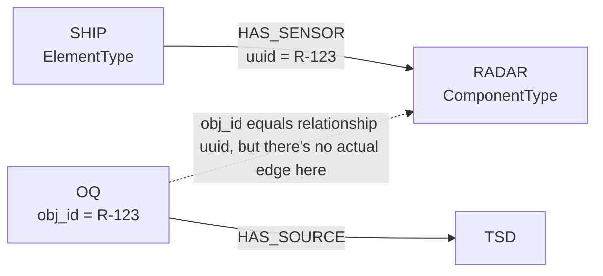
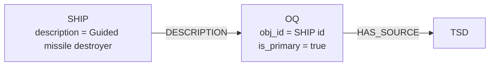
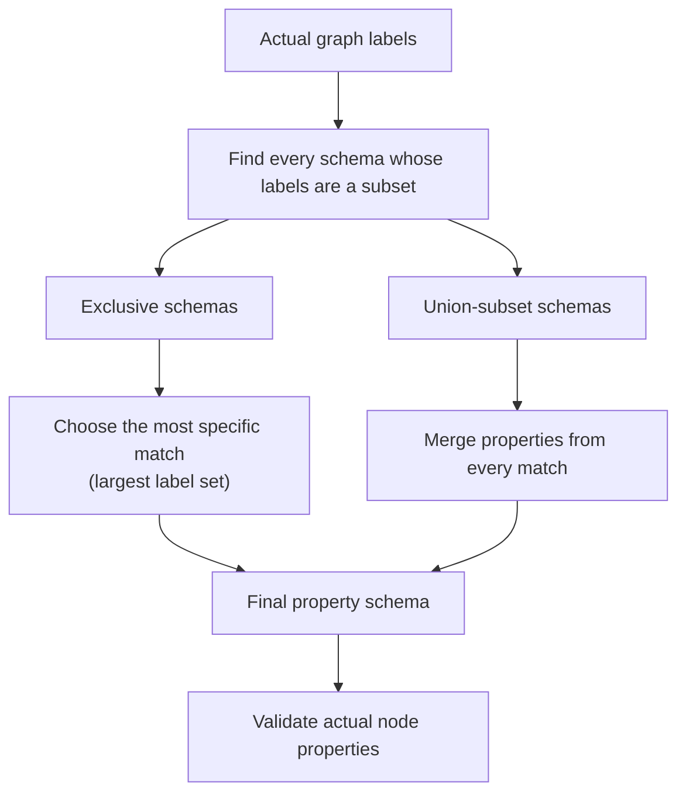

The system follows a three-tier architecture:
1. Frontend Layer (`ui/`): React/SolidJS UI for user interaction.
2. API Layer (`api/`): FastAPI REST endpoints with CORS middleware. 
3. Agent Layer (`agents/`): Agent-based processing pipeline.
4. Service/Tool Layer (`services/`, `tools/`): Supporting services/utilities.


```
kg-curator/
├── src/kg_curator/          Python backend and domain logic
│   ├── api/                 FastAPI HTTP interface
│   ├── agents/              Stateful/LLM-driven actors
│   ├── tools/               Reusable ingestion and graph operations
│   ├── services/            Wrappers around Neo4j/OpenAI/Anthropic
│   ├── prompts/             LLM prompt definitions
│   ├── schemas/             Ontology/schema source of truth and editor
│   ├── coherence/           Live graph-versus-schema validation
│   └── forge/               Notebooks, experiments, and one-off scripts
├── ui/                      SolidJS/TypeScript web application
├── data/                    Local runtime data and sample inputs
├── tests/                   Python test suite
├── Documentation/           Design notes and technical specifications
├── run_api.py               Backend development entry point
├── Makefile                 Common development commands
├── pyproject.toml           Python package and tool configuration
├── uv.lock                  Locked Python dependencies
├── Dockerfile               Backend image definition
└── docker-compose.yml       Local SQLite helper container
```
More Notes:
- `api/`: The HTTP boundary... exposes backend functionality callable by the Web UI
- `agents/`: Contains classes representing distinct processing responsibilities. An "agent" here may combine LLM calls, database reads, and tool calls, but some classes (PDF parser, database agent) are called agents even though they don't use an LLM.
- `tools/`: Reusable business operations. This is where lower-level algorithms and graph operations live; Agents and API handlers call these when they need an operation but not another "actor."
	- `graph_tools.py`: Graph constraints, node matching, parameter extraction, OQ graph writes, etc.
	- `tabular_seed.py`: CSV/Excel loading, schema validation, row validation, OOB and sensor ingestion, Cypher generation, lineage, and orchestration.
- `services/`:  External-system adapters. Provides relatively thin wrappers around third-party systems. Things like `openai_service.py` and `anthroptic_service.py` and `neo4j_service.py`, for instance.
	- (Note that most agents inherit `BaseAgent` and use its OpenAI client directly, so OpenAIService is currently tested but not the primary path used by those agents.)
- `prompts/`: LLM behavior; keeps large system prompts out of the agent class.
- `schemas/`: Not merely a collection of Python/Pydantic data models. It's the ontology/schema subsystem,: the declared node types, allowed relationships, property definitions, inheritance behavior, and NodeInit eligibility. Everything here supports the `.yaml` files in `schemas/definitions/scopes/` that define properties, relationships, etc.
- `coherence/`: Compares the live Neo4j graph with the declarations in `schemas`.
- `forge/`: Experimental workbench; mainly a collection of Jupyter notebooks used to develop, test, inspect, or train individual parts of the system. It's not part of the web-server request flow. Code may begin here and later moev into agents/tools/schemas.


More on `ui/`:
```
ui/
├── src/
│   ├── index.tsx            Browser entry point
│   ├── App.tsx              Global styles, layout, dialog host
│   ├── components/          Screens and reusable visual components
│   ├── hooks/               Workflow state and API calls
│   ├── types/               Frontend domain/API types
│   └── utils/               Dialog, graph, label, and filter helpers
├── package.json
├── vite.config.ts
├── tsconfig.json
└── biome.json
```

More on `data/`:
```
data/
├── LinProvDB/kg_curator.db   Local SQLite lineage database
├── mockS3/
│   ├── SD/                   Example source documents
│   └── TSD/                  Example transformed text documents
├── tab_seed_mock/            Example OOB, sensor, and WpnNet files
├── sat_seed/                 Satellite seed source/transformation
└── geometries/               Example KML files
```


More on Coherence:
```
validator.py
├── graph_client.py             Fetch scoped nodes/relationships
├── rules/relationships.py     Check relationship allow-list
├── rules/properties.py        Check missing/extra/wrong-type props
├── rules/scope_nodes.py       Match graph labels to schema node types
├── scope_anchors.py           Define which nodes belong to each scope
├── models.py                  Audit result dataclasses
└── cache.py                   Hold recent audit results in memory
```


# ==(1) KGAS: Knowledge Graph Auto-Scaler==  📝
- The unstructured-document ingestion path.
- A user uploads a PDF, and the PDF parser extracts its text. 
- The original file is treated as a ==Source Document (SD)==, while the extracted text becomes a ==Transformed Source Document (TSD)==. 
	- The parser assigns identifiers to both and stores the TSD in a local SQLite lineage database so that later stages can retrieve and reprocess it without uploading the PDF again.
- The ==Ontology Translator Agent (OTA)== sends the extracted text and ontology instructions to an OpenAI model. 
	- Converts statements in the document into ==Ontology Quanta (OQ)==, small asserts in a `subject|predicate|object` form.
		- e.g. Relationships like `ElementType:ARLEIGHBURKE | HAS_CAPABIILTY | Capability:AIR_DEFENSE`, for instance, or a property assertion where the `object`  has no graph label, like `ComponentType:Type 346A | description | active electronically scanned array radar system`.
		- Each OQ is stored with its TSD identifier.
- The ==Graph Curator Agent (GCA)== then parses each OQ, looks for aliases in SemNet, retrieves one-hop graph context, and attempts to replace ambiguous names with canonical graph entities.
- The ==Cypher Execution Agent (CEA; also called Cypher Agent)== turns enriched OQs into graph writes, using `MERGE`-style operations so rerunning the same assertion converges instead of continually duplicating data, and handles relationship and property OQs differently.
	- The affected domain nodes receive `KGAS`, while corresponding `LinProv:TSD` and `LinProv:OQ` nodes record where the assertion came from.
		- ==This is interesting to note:== the `KGAS` label just means "this node was *affected* by the Knowledge Graph Auto Scaler"; an existing node receives `KGAS` label when KGAS reuses or modifies it, so the label means "touched by KGAS," not *necessarily* "originally created by KGAS."

If OTA produces an OQ like this: `ElementType:Type 052D | ELEMENT_CAPE | Capability:Air Search Radar`, then the graph writer produces a structure conceptually like this:
```
# The graph writer turns that into ordinary Neo4j domain data:
(Type 052D:ElementType:KGAS)
        |
        | ELEMENT_CAPE {uuid: "relationship-123"}
        v
(Air Search Radar:Capability:KGAS)


# And also creates a provenance record; the OQ is a receipt, and the TSD records where that OQ came from.
(OQ:LinProv:KGAS {
    oq_text: "ElementType:Type 052D | ELEMENT_CAPE | Capability:Air Search Radar",
    obj_id: "relationship-123"
})
        |
        | HAS_SOURCE
        v
(TSD:LinProv:KGAS {
    tsd_url: "TSD_abc123",
    sd_url: "source-document.pdf"
})
```
==Notice== that *there isn't literally an edge from the OQ to the domain relationship! (In the case of a ==Relationship OQ)==*
- Instead, the connection is made through IDs: 
	- `OQ.obj_id=ELEMENT_CAPE.uuid`
- Q: *WHY* don't we just connect the OQ to the specific node or relationship? 
	- A: The problem is that the thing an OQ is informing is *often* a relationship, not a node, and in standard Neo4j, you can't create a relationship to edges, just to nodes, so we can't do what feels like the obvious thing of `(OQ)-[:Supports]->(ELEMENT_CAPE)`. This is why we use the UUID indirection, where the OQ has an `obj_id` which is the `uuid` of the thing it's related to. It's implemented sort like a foreign key reference, I guess you could say.
- Q: It's interesting that current KGAS graph writes don't create a separate `LinProv:SD` node. Instead, the TSD stores the source document (SD) identifier in its `sd_url` property. Other workflows like NodeInit create a fuller `OQ -> TSD -> SD` graph chain.
	- ...
- Q: Wait, you just said ==Relationship OQ==, which is different from a ==Property OQ==, what's the difference?
	- A: Relationship OQs use a indirect identifier link, while Property OQs use a real Neo4j relationship/edge from the subject to the OQ. This again is because relationships can't be the target of relationships, so for OQs that end up in the creation of a relationship, we *can't* use an edge to point to it, like we can in the property case.

### Relationship OQ:

There's no actual graph edge connecting the OQ to teh HAS_SENSOR relationship, instead:
```
HAS_SENSOR relationship:
    uuid = "R-123"

OQ node:
    obj_id = "R-123"
```

#### Property OQ
For one like 
```
ElementType:SHIP | DESCRIPTION | Guided missile destroyer
```
KGAS creates:

Here, the provenance edge is concrete:
```
(subject)-[:DESCRIPTION]->(oq)
```
The relationship type comes from the OQ predicate, converted to uppercase. The OQ stores the subject's ID on obj_id, but rollback identifies it primarily through the incoming provenance edge.

# ==(2) KGTS: Knowledge Graph Tabular Seed== 🌱
- KGTS is the structured-data ingestion path, receiving CSV and Excel files whose rows already describe known entities and relationships, avoiding the interpretive LLM stages used by KGAS.
- Before writing anything, it loads the sheets into pandas, normalizes values, coerces expected data types, parses bracketed lists, verifies required columns, checks identifiers and relationship references, and reports errors by sheet, row, and column.
- Once data passes validation, the loader turns rows into parameterized batch Cypher.
- KGTS supports ==four first-class tabular purposes== (as of August 2026); the caller must choose `data_type`:
	- `oob`: Load operational formations and elements, resulting in InstanceNet nodes plus user-specified hierarchy relationships.
	- `sensor`: Attach sensors to platform types, resulting in `ElementType-[:HAS_SENSOR]->ComponentType:SensNet`
	- `has_effector`: Describe a platform's effectors, resulting in `ElementType[:HAS_EFFECTOR]->ComponentType:WpnNet`
	- `effect`: Describe what an effect can act against, resulting in `ComponentType:WpnNet-[:EFFECT]->ElementType`
- `OOB/InstanceNet` Schema
	- The most general schema, intended for formations/units/platforms and their operational hierarchy. Each node defines one graph node, and a row can also reference other rows by temporary IDs, causing KGTS to create one or more outgoing relationships.
	- Columns:
		- `start_id`: `str`, temporary identifier in the file/workbook.
		- `labels`: `[str]`, labels placed on Neo4j node
			- The intended labels aer `FormationInstance` and `ElementInstance`, as well as warfighting function labels like `Fires` or `Intelligence`.
		- `start_name`: `str`: Becomes the node's `name` property
		- `description`: `str?`: Human-readable `description` property
		- `lat`: `float`: Latitude
		- `lon`: `float`: Longitude
		- `team`: `string`: Usually `RED`, `BLUE`, etc., becoming `team` property
		- `country`: `string`: Country code such as `USA` or `RUS`
		- `end_id`: `[str]?`: IDs of target rows
		- `rel_type`: `str?`: Relationship type; required when `end_id` is populated
	- Example:
		- ```
		start_id,labels,start_name,description,lat,lon,team,country,end_id,rel_type
		5-b,"[FormationInstance, Fires]",Subsurface Forces,Northern Fleet submarines,69.0667,33.4,RED,RUS,"[5-b1, 5-b2]",SUBFORMATION
		5-b1,"[FormationInstance, Fires]",11th Submarine Division,Nuclear submarine division,69.3191,32.8049,RED,RUS,"[5-b1a]",HAS_ELEMENT
		5-b1a,"[ElementInstance, Fires]",SSGN-Yasen_K-560_RUS,Yasen-class cruise missile submarine,69.32,32.81,RED,RUS,,
		
		Producing, ROUGHLY:
		(:FormationInstance:Fires {name: "Subsurface Forces", ...})
			-[:SUBFORMATION]->
		(:FormationInstance:Fires {name: "11th Submarine Division", ...})
			-[:HAS_ELEMENT]->
		(:ElementInstance:Fires {name: "SSGN-Yasen_K-560_RUS", ...})
		  ```
	- See that every `end_id` must resolve to a `start_id` somewhere in the same CSV/Excel workbook., or validation reports a blocking error.
	- Imported `ElementInstance` rows can also trigger creation of corresponding `ElementTypes`, `SemTroids`, and instance-to-type relationships (enabled by default through `auto_generate_types=True`)
		- During OB load, after the `ElementInstance` nodes themselves have been written, KGTS recognizes eligible ElementInstance rows. 
		- A type is derived from the ElementInstance's naming convention (`{TYPE}_{INSTANCE_IDENTIFIER}_{THREE_LETTER_COUNTRY})`. We just extract the `{TYPE}` from there. `team` (and `mode`) are eligible for inheritance from the instance, and set only when the ElementType is newly created: `MERGE (et:ElementType {name: "SSGN-Yasen_RUS"})`. 
			- (Aside: Neo4j's `MERGE` means "Find an ElementType whose `name` exactly matches; if none exists, create one)
		- KGTS also merges a SemTroid: `MERGE (st:SemTroid {name: "SSGN-Yasen_RUS"}) SET st:SemNet`. The SemTroid is intentionally minimal; only its canonical name is established, providing semantic scaffolding that later entity-resolution and curation workflows can use.
		- KGTS then connects all resulting nodes appropriately.
- `Sensor/SensNet` Schema
	- For connecting known platform types to their sensors.
	- Unlike the OOB loading, it doesn't accept arbitrary node labels or arbitrary relationship types: the platform must *already exist* as an `ElementType`; KGTS creates or merges sensor `ComponentType` nodes and connects them with `HAS_SENSOR`.
	- Columns:
		- `id`: `str`: Temporary row identifier
		- `platform_type`: `str`: Exact name of an existing `ElementType`
			- *Must* exactly match an existing ElementType.name. KGTS never creates the platform from a sensor file; a missing platform causes that row to fail or be skipped.
		- `sensor_name`: `[str]`: Sensors to create or merge.
		- `modality`: `[str`]: Modality corresponding to each sensor.
		- `mode`: `[str]`: `Air`, `Ground`, or `Space` for each sensor.
	- Example:
		- ```
		id,platform_type,sensor_name,modality,mode
		s1,F-16_USA,"[AN/APG-68 Radar, AN/ALQ-184 ELINT]","[Radar, ELINT]","[Air, Air]"
		s2,RC-135_USA,"[RFeye Node 40-8]","[ELINT]","[Air]"
		s3,MilSatSAR_USA,"[Space SAR Payload]","[SAR]","[Space]"
		
		Each sensor becomes approximately:
		(:ElementType {name: "F-16_USA"})  # Recall that this already had to exist in the graph
	    -[:HAS_SENSOR]->
		(:ComponentType:SensNet:Radar:Air {
		    name: "AN/APG-68 Radar",
		    modality: "Radar",       # It's interesting to note that modality/mode values also seem to be somewhat duplicated with existing labels (eg. Air, Land, EOIR,etc.)
		    mode: "Air",
		    ...
		})
		  ```
	  - ==Note:== The three list columns are positional. For the first row, this means that (AN/APG-68 Radar, Radar, Air) and (AN/ALQ-184 ELINT, ELINT, Air) are matched up.
		  - The lists therefore must contain the same number of items.
	- ==Note:== The sensor node receives properties determined by the modality/mode combination, but ==most values begin as null==, producing a structure that `NodeInit` or a curator can fill in later.
		- Radar creates fields like frequency, power, gain, bandwidth, and range.
		- ELINT initializes receiver sensitivity, frequency limits, and direction-finding fields.
	- Note: The loader does accept human-friendly or legacy spellings of some of the modalities, e.g. "Electronic Intelligence" gets mapped to "ELINT"
	- The modes supported by each modality are:
		- `ELINT`: Air, Ground, Space
		- `Radar`: Air, Ground
		- `SIGINT`: Air, Ground Space
		- `EOIR`: Air, Ground, Space,
		- `SAR`: Air, Ground, Space
		- `INSAR`: Air,. Ground, Space
	- ==Note:== An unrecognized modality is not currently rejected; KGTS will still create a `ComponentType:SensNet` node with its mode label, but it won't get a ==modality-specific property bundle==. Same thing if you did an unsupported modality/mode combination, like `Radar:Space`.
- `WpnNet HAS_EFFECTOR` Schema
	- This schema describes platform loadouts: Which effector or weapon component a platform type possesses. 
	- Each row represents exactly one relationship, there are no lists involved like in other instances.
	- Columns:
		- `platform_name`: `str`: Existing `ElementType.name`
			- The ElementType must exist
		- `platform_team`: `str`: Reporting/context, not a match key.
			- ((CRUFT: It seems that the loader doesn't use it to find/create/update the platform... it's included in error/skip reports only.  If the platform_name exists with both team RED and BLUE, both rows still match, so this isn't actually used. Note also that ELementType names include the countrycode too, so it's not likely that we'd have both a F-16_USA, BLUE and an F-16_USA, RED... seems crufty.))
		- `relationship`: `str`: Must be exactly `HAS_EFFECTOR`
		- `component_name`: `str`: WpnNet effector name
		- `component_team`: `str`: Team assigned if component is created.
		- `weight`: `float`: Placed as a `weight` property on the created `HAS_EFFECTOR` relationship, which indicates how many of an effector we can currently hold.
	- Example:
		- ```
		platform_name,platform_team,relationship,component_name,component_team,weight
		F-16_USA,BLUE,HAS_EFFECTOR,AIM-120,BLUE,1.0
		SSGN-Yasen_RUS,RED,HAS_EFFECTOR,3M14,RED,0.8
		CVN-78_USA,BLUE,HAS_EFFECTOR,RIM-174,BLUE,0.9
		
		# Each row produces something like:
		(:ElementType {name: "F-16_USA"})
	    -[:HAS_EFFECTOR {weight: 1.0}]->
		(:ComponentType:WpnNet {name: "AIM-120", team: "BLUE"})
		  ```
	- Note: The platform itself must already exist. If the `ComponentType:WpnNet` node doesn't exist, though, this loader is allowed to create it. The new component receives `name`, `team`, layout coordinates, and the remaining ComponentType properties frmo the WpnNet YAML schema initialized to `null`. So this mode of KGTS is serves a ==dual purpose== a relationship loader (between existing ElementType platforms and ComponentType effectors) as well as an entry point for creating new effector types that don't yet exist.
- `WpnNet EFFECT` Schema
	- Describes the target or platform type against which an effector has an effect. It reverses the direction used by `HAS_EFFECTOR`: The ComponentType effector is the source, and an ElementType is the target.
	- Columns:
		- `component_name`: `str`: The existing `ComponentType:WpnNet.name`
		- `component_team`: `str`: Reporting/context only
		- `relationship`: `str`: Must be exactly `EFFECT`
		- `platform_name`: `str`: Existing target `ElementType.name`
		- `platform_team`: `str` Used for reporting/context only.
		- `weight`: `float` Effect strength or weighting
		- `tq_req`: `float`: Track Quality requirement stored as tq_req on the relationship
	- Example
		- ```
		component_name,component_team,relationship,platform_name,platform_team,weight,tq_req
		AIM-120,BLUE,EFFECT,Su-57_RUS,RED,0.75,2.0
		3M14,RED,EFFECT,CVN-78_USA,BLUE,0.9,5.0
		RIM-174,BLUE,EFFECT,Kirov_RUS,RED,0.85,3.5
		
		# Each row produces something like:
		(:ComponentType:WpnNet {name: "AIM-120"})
		    -[:EFFECT {weight: 0.75, tq_req: 2.0}]->
		(:ElementType {name: "Su-57_RUS"})
		  ```
	- ==Unlike== `HAS_EFFECTOR`, this EFFECT mode ==never creates either endpoint==: Both the WpnNet component and target ElementType must already exist exactly once. A mising or ambiguous match skips teh row and appears ni the import summary.
	- Like `HAS_EFFECTOR`, relationship properties are creation-time values, and rerunning the same row merges the existing edge, preserving its current `weight` and `tq_req`

- ==Shared Behavior==: All four schemas require an explicit data-purpose selection in the UI, or a `data_type` form field in the API. Files got hrough column validation, string cleanup, numeric coercion, and row-level error reporting. missing required columns are file-level failures, while bad values and unresolved graph endpoints are generally reported as skipped rows so that valid rows can continue.

Note regarding use of end_id in KGTS:
```
| id | name        | label             | relationship  | end_id |
|----|-------------|-------------------|---------------|--------|
| 1  | USS Nimitz  | ElementInstance   | HAS_COMPONENT | 2      |
| 2  | Radar A     | ComponentInstance |               |        |
| 3  | Radar B     | ComponentInstance | PART_OF       | 1      |
```
The `end_id` is a file-local identifier (like `id`) that basically acts as a foreign key that lets rows in the spreadsheet refer to eachother. You can see how it's being used to identify the `B` node in `A->B` relationships. It seems to me that this means that you can't have relationships to nodes that are not themselves in the table (e.g. those that are already in the graph but not in the table).


# ==(2.5) NodeInit==
- It's not exposed as a top-level UI workflow or FastAPI route, unlike KGAS, KGTS, or Coherence.
- NodeInit is a substantial third operational workflow:
	1. It selects existing Neo4j nodes.
	2. It uses the schema registry to determine which properties those nodes should have.
	3. It identifies missing values.
	4. It researches values with OpenAI web search.
	5. If research fails, it can estimate values from similar graph nodes.
	6. It coerces results to the schema's declared types.
	7. It writes the properties with SD ->TSD -> OQ provenance.
- Architecturally, it sits after ingestion:
```
KGAS / KGTS
      │
      ▼
Nodes exist in Neo4j
      │
      ▼
NodeInit detects incomplete properties
      │
      ├── Web research + citations
      └── Similar-node estimation
      │
      ▼
Property updates + provenance
```
- To be clear, ==NodeInit is not automatically incorporated into either KGAS or KGTS today==; those produce nodes that NodeInit can enrich later, but neither pipeline calls it.
	- KGTS does however prepare data for NodeInit; sensor ingestion creates modality-specific properties with empty/default values, etc.
		- NodeInit can subsequently find those incomplete KGTS-created nodes and research the missing values.
	- NodeInit is ==currently triggered== NodeInit


# ==(3) KG Coherence Suite==
- The Coherence Suite is the graph's quality-control system, comparing the live Neo4j graph with the declared ontology schema one scope at a time.
	- > "A schema-aware linter" for the knowledge graph. "Does the graph we have actually conform to the graph model we intended?"
	- It compares the **ontology schema** (the repo's declaration of what each graph area is supposed to contain, e.g. `ElementInstance` nodes should have XYZ properties, and may have certain relationship types) with the **actual Neo4j graph**.
- Logical Scopes:
	- Include:
		- `InstanceNet`: Operational formations, platforms, components, and other concrete instances.
		- `TypeNet Shared`: Type information shared across TypeNet domains
		- `WpnNet`:  Weapon and effector type structures
		- `SenNet`: Sensor and sensing-component types
		- `LogNet`: Logistics-related types
		- `CapeNet`: Capabilities and capability relationships
		- `SemNet`: Semantic identities, aliases, and taxonomies
	- Each scope has its own node types, properties, and allowed relationships. A property can therefore be valid on one kind of `ComponentType` but invalid on another. For example, `frequency_min_hz` makes sense for certain SensNet sensors, but wouldn't automatically be allowed on an arbitrary logistics component. 
- Its current property audit detects:
	- Required properties that are missing
	- Values with the wrong type
	- Properties that are not allowed for the matched node type

If the schema contains:
```
Node type: ElementInstance

Properties:
  name: string, required
  team: string, required
  country: string, optional
  lat: float, optional
  lon: float, optional

Allowed relationship:
  ElementInstance -[IS_INSTANCE]-> ElementType
```
But Neo4j contains:
```
(:ElementInstance {
    name: "USS Example",
    team: null,
    country: "USA",
    speed: "fast"
})

(:ElementInstance)-[:HAS_CAPABILITY]->(:Capability)
```
- Coherence should find three issues:
	- `team` is missing, even though the schema requires it
	- `speed` is an extra property because it's not declared for `ElementInstance`
	- `ElementInstance-[HAS_CAPABILITY]->Capability` is an unknown relationship pattern in this scope.
- The missing property and unknown relationships are treated as ==errors==, while extra properties are treated as ==warnings==.
- How node property validation works:
	- The validator first Neo4j which schema scope is being checked (e.g. InstanceNet, or TypeNet SensNet)
	- It queries Neo4j for nodes anchored in that scope and removes operational labels like `KGAS` and `KGTS` (which only say how a data entered the graph, not what a node represents).
		- If a sensor has labels like `ComponentType, SensNet, ELINT, Air, KGAS, KGTS`, the relevant schema type is the combination: `ComponentType, SensNet, ELINT, Air`
	- Once it finds the schema type, it checks every declared property.
		- A required property with no "meaningful value" becomes a `missing_property` violation.
		- A value whose Python/Neo4j representation doesn't match the declared str, int, float, or bool types becomes a `wrong_property_type` violation.
		- A property present on the node but absent from the schema becomes an `extra_property` warning.
		- Operational fields like `uuid`, `x_pos`, `y_pos`, and `element_id` are specially ignored by the extra-property check.
- How relationship validation works
	- The schema defines allowed relationship patterns as triples:
		- ```
		source label set -> relationship type -> target label set
		FormationInstance -[HAS_ELEMENT]-> ElementInstance
		ElementInstance -[IS_INSTANCE]-> ElementType
		ElementType:SensNet -[HAS_SENSOR]-> ComponentType:SensNet
		  ```
	- The validator queries Neo4j for the relationship patterns that are actually present in scope, and counts how many instances of each pattern exist. It canonicalizes the source/target labels so ingestion labels and other irrelevant labels don't create false distinctions.
	- Each pattern receives one of three status:
		- `allowed`: The pattern is declared in the schema and appears in the graph.
		- `schema_only`: The schema permits the pattern, but not example currently exists in the graph.
			- Not necessarily an error; it might mean the ontology supports something that hasn't yet been ingested.
		- `violating`: The graph contains the pattern, but the schema does not permit it.
			- Meaningful warning indicating that the graph and schema have drifted apart.
- Sometimes a disagreement means that the graph is wrong (e.g. an `ElementInstance` is missing its required `team` and should probably be fixed through ingestion or NodeInit.), and other times the schema is behind reality: Perhaps we decided that `ElementInstance-[HAS_CAPABILITY]->Capability` is now a valid relationship; in that case, the curator should update the ontology, rather than eliminate legitimate graph dat.
- ==The schema registry is also intended to be shared with the ingestion systems.==
	- KGAS could use it to tell the ontology translator what node types and relationships exist.
	- KGTS can use it when validating tabular input.
	- NodeInit can use it to determine which properties a node is missing.
	- Coherence uses it to audit what's already in Neo4j.
- Coherence does not automatically repair the graph, and it's not currently a continuous monitor. Validation runs when explicitly required, and the audit cache exists only in the running backend process. 


Q: For property validation, when we say "it checks every declared property", what exactly do we mean by that, mechanically?
- A: Note that the documented design (which uses a hybrid of combination schemas and inherited schemas) is not fully implemented by the current code (which does something simpler and somewhat different)... but we can talk about how this works. 
- The fundamental unit is a ==label-set schema==... a schema entry is not attached to one label, it is attached to a declared combination of labels, represented by `NodeTypeSpec`:
- ```
  NodeTypeSpec(
	  id="air_componenttype_elint_sensnet",
	  labels=["SensNet", "Air", "ComponentType", "ELINT"],
	  properties=[...]
  )
  ```
  - Conceptually, that entry says: **Any graph node containing *at least* SensNet/Air/ComponentType/ELINT can be treated as this node type.**
	  - This is ==subset matching, not exact matching.== Therefore this matches a node with all of ComponentType,SensNet,ELINT,Air,OtherLabel,OtherLabel2.
- Practically, we see that for domain-specific sensor nodes, the repository follows our first model where each meaningful combination has its own schema:
	- ```
		ComponentType + SensNet + ELINT + Air
		ComponentType + SensNet + ELINT + Ground
		ComponentType + SensNet + ELINT + Space
		
		ComponentType + SensNet + Radar + Air
		ComponentType + SensNet + Radar + Ground
		
		ComponentType + SensNet + EOIR + Air
		ComponentType + SensNet + EOIR + Ground
	  ```
- Each entry contains a cmoplete property list - for example, an Air ELINT sensor might permit (frequency_min_hz, frequency_max_hz, df_accuracy_dg, sensitivity_dbm, instantaneous_bandwidth_hz), while a Air Radar sensor might permit a different set of properties.
- So, to be clear: ==There is no current mechanism that says 'take properties from ComponentType, add properties from SensNet, add properties from ELINT, and then add properties from Air"==.
- What matching is **supposed to become**:


Something like this, a "hybrid resolver" with `exclusive` schemas (representing mutually exclusive domain types; choose the most specific matching combination) and `union_subset` schemas (representing inherited or shared concerns; merge every matching schema's properties.)

In the **intended** world, imagine the registry contains:
```
A. [ComponentType]
   strategy: union_subset
   properties: name, description

B. [ComponentType, SensNet]
   strategy: union_subset
   properties: modality

C. [ComponentType, SensNet, ELINT]
   strategy: exclusive
   properties: frequency_min_hz, frequency_max_hz

D. [ComponentType, SensNet, ELINT, Air]
   strategy: exclusive
   properties: std_employment_alt, df_accuracy_deg
```
And the node has:
```
[ComponentType, SensNet, ELINT, Air, KGAS]
```
The **intended** algorithm would:
1. Remove `KGAS`
2. Find all four matching schemas (matching because the schema is a subset of the labels of our node's labels.
3. Union properties from A and B (`union_subset` schemas)
4. Among C and D, choose D because it is more specific (meaning is a larger subset)
5. Merge (A+B)+D
6. Validate the node against the resulting property set.

**Currently**, though, the `NodeTypeSpec` doesn't have a match strategy, shared/domain metadata, or inheritance information, it just has:
```
id
labels
properties
```

For property validation, the current algorithm is effectively:
```python
cleaned_labels = actual_labels - {"KGAS", "KGTS"}

candidates = [
    schema
    for schema in schemas
    if set(schema.labels) <= set(cleaned_labels)
]

selected = min(
    candidates,
    key=lambda schema: (
        len(schema.labels),
        formatted_schema_name,
    ),
)
```
Which is just:
1. Find every schema whose labels are a subset of the graph's node labels
2. Choose exactly one schema
3. Choose the schema with the fewest labels (the least specific match)
4. Validate against only that schema's property list.

This seems to validate against only the ==least specific match==, which is surprising. If we had two schemas:
```
A: [ComponentType, SensNet]
B: [ComponentType, SensNet, ELINT, Air]
```
And the graph node is 
```
[ComponentType, SensNet, ELINT, Air]
```
Then both A and B match, because they're subsets, but the current validator selects A, because it has two labels, while B has four.

# (4) Ontology and schema management in `schema`
- The `schema` package defines what the graph is supposed to look like.
- Each YAML scope describes recognized node types as ==label sets==, the ==properties allowed== on those types, ==property types== such as string or float, whether properties are ==required==, and ==whether they are candidates for automatic filling==.
- It also lists ==permitted relationships== as (source-label-set, relationship-types, and target-label-set) triples.
- `SchemaRegistry` loads these YAML files into Python models and provides a single interpretation layer for the rest of the application. 
- The dashboard also acts as a schema editor. A curator can add/update/remove properties and relationship rules in an in-memory draft, inspect the cumulative diff, discard it, and revalidate the graph against the graph before publishing it. 
	- In workspace mode, this writes the edited definitions back to YAML; in PR mode, it serializes the changes and opens a Github pull request.

# (5) Lineage and Provenance
- Lineage explains the derivation chain of information (SD -> TSD -> OQ -> Graph Fact).
	- The SD represents the original source
	- The TSD represents the form actually consumed by a system (extracted PDF text, source URL, or tabular import identity)
	- The OQ represents the smallest assertion derived from that source.
	- The OQ identifies the graph relationship or property contribution it produced, usually through an object identifier or a provenance relationship.

# (6) Rollback
- Reverses KGAS writes using ilneage rather than trying to generate inverse Cypher from the original operation.
- A rollback request specifies a TSD identifier and can optionally specify an exact OQ.
	- The preview operation first finds OQs connected to that TSD and reports how many correspond to graph relationships, how many represent property contributions, whether the TSD exists, and the OQ texts that would be affected.
- During execution, ==Relationship OQs== are matched to graph relationships through the UUID stored in the `oq.obj_id`. Those relationships and their OQ nodes are deleted. 
- ==Property OQs== are found through the provenance relationship from the subject node, and the related property contribution is removed before deleting the provenance link and OQ.
- A full--TSD rollback rmoves the Neo4j TSSD node if it no longer has OQs and clears OTA quanta for that TSD from SQLite...


# Aside on Schemas

Everything the current schema can express:

At the top level, a ==ScopeSchema== contains:
```python
ScopeSchema(
    scope="typenet-sensnet",
    node_types=[...],
    relationships=[...],
)
```
- scope: Internal scope identifier used by the API and validator
- subgraph: Human-readable network name
- node-types: Recognized label-set schemas
- relationships: Allowed source-relationship-target patterns.

A ==NodeTypeSpec== contains exactly three stored fields:
```python
NodeTypeSpec(
    id="air_componenttype_elint_sensnet",
    labels=["SensNet", "Air", "ComponentType", "ELINT"],
    properties=[...],
)
```
The labels are an applicability selector: 
```
schema.labels ⊆ graph_node.labels
```
They ==DO NOT== currently express:
- Forbidden labels
- An exact-label requirement
- Label alternatives
- Label inheritance
- Exclusive versus shared matching behavior
- A priority between schemas
- Abstract versus concrete node types

==PropertySpec==
```
PropertySpec(
    name="frequency_min_hz",
    type="float",
    required=False,
    auto_fill=True,
    description="minimum receivable frequency in Hz",
)
```
Here, 
- `name:` Neo4j property name
- `type:` Expected primitive type (str, int, float, bool)
	- So we can say that a property must be a float, but cannot currently say which float values are valid.
- `required`: Whether the validator considers a missing value an error
	- There is no notion of forbidden properties.
- `auto_fill`: Whether NodeInit may try to populate it
- `description`: Human/agent-facing explanation

A PropertySpec cannot currently define:
- Enumerate values like `team ∈ {RED, BLUE, GREEN}`
- Numeric ranges like 0 <= quantum_efficiency <= 1
- Minimum or maximum string lengths
- Regular expression patterns
- Units as machine-readable metadata
- Default values
- Nullable versus optional as separate concepts
- Lists or structured objects
- List element types
- Union types like `str|int`
- Cross-property rules
- Conditional properties
- Uniqueness
- Immutable properties
- Computed properties
- Deprecation status

A ==RelationshipRule== is defined separately at the scope level:
```python
RelationshipRule(
    source="SensNet:ElementType",
    relationship="HAS_SENSOR",
    target="SensNet:ComponentType",
)
```
This expresses an allowed directed pattern: `source label set -[relationship type]-> target label set`

This current relationship schema can express:
- Required minimum source labels
- Relationship type
- Required minimum target labels
- Direction

It can't express:
- Required relationships
- Minimum or maximum cardinality
- Exactly one parent
- Relationship properties
- Relationship-property types
- Conditional relationships
- Mutually-exclusive relationships
- A forbidden relationship rule separate from absence in the allow-list
- Whether a relationship must be acyclic
- Path-level constraints


